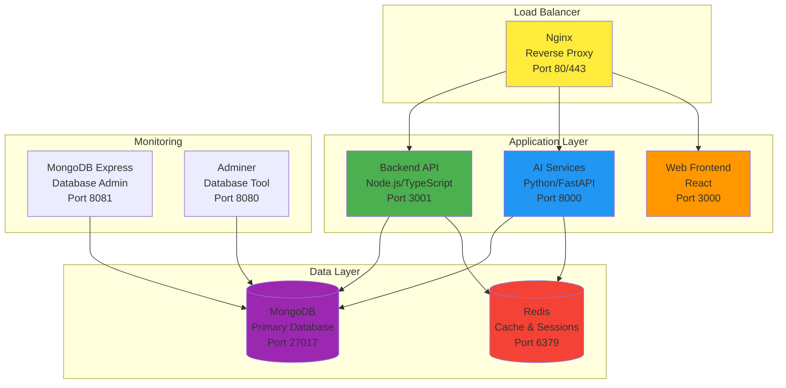
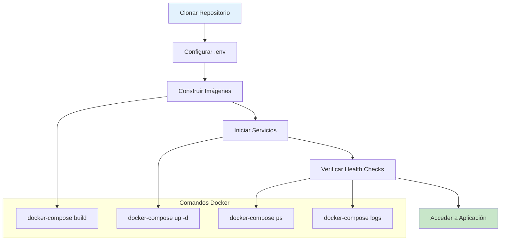

# RespiCare - Guía de Despliegue con Docker

Esta guía proporciona instrucciones detalladas para desplegar el sistema RespiCare utilizando Docker y Docker Compose.

## 📋 Tabla de Contenidos

- [Requisitos Previos](#requisitos-previos)
- [Arquitectura del Sistema](#arquitectura-del-sistema)
- [Configuración Inicial](#configuración-inicial)
- [Despliegue en Desarrollo](#despliegue-en-desarrollo)
- [Despliegue en Producción](#despliegue-en-producción)
- [Gestión de Servicios](#gestión-de-servicios)
- [Backup y Restauración](#backup-y-restauración)
- [Monitoreo y Logs](#monitoreo-y-logs)
- [Solución de Problemas](#solución-de-problemas)
- [Seguridad](#seguridad)

## 🔧 Requisitos Previos

### Software Requerido

- Docker Engine 20.10+ ([Instalar Docker](https://docs.docker.com/get-docker/))
- Docker Compose 2.0+ ([Instalar Docker Compose](https://docs.docker.com/compose/install/))
- Git
- **FFmpeg** (requerido para servicios de audio - Whisper)
  ```bash
  # Ubuntu/Debian
  sudo apt-get update && sudo apt-get install -y ffmpeg
  
  # macOS
  brew install ffmpeg
  
  # Windows (usando Chocolatey)
  choco install ffmpeg
  ```
- 4GB RAM mínimo (8GB recomendado para desarrollo, 16GB para producción)
- 20GB de espacio en disco (30GB+ recomendado para modelos ML y datasets)

### Verificar Instalación

```bash
docker --version
docker-compose --version
git --version
```

## 🏗️ Arquitectura del Sistema

El sistema RespiCare se compone de los siguientes servicios:



### Servicios

1. **MongoDB**: Base de datos principal
2. **Redis**: Cache y gestión de sesiones
3. **Backend API**: API REST en Node.js/TypeScript
4. **AI Services**: Servicios de análisis con IA en Python
   - Análisis de síntomas con ML (99.64% accuracy)
   - Análisis de imágenes médicas (ResNet50)
   - Procesamiento de audio/voz (Whisper + Librosa)
   - Transcripción multilingüe
   - Análisis de tos
5. **Nginx**: Proxy reverso y balanceador de carga
6. **Backup**: Servicio automatizado de respaldo

## ⚙️ Configuración Inicial

### 1. Clonar el Repositorio

```bash
git clone https://github.com/tu-usuario/respicare.git
cd respicare
```

### 2. Configurar Variables de Entorno

Copiar el archivo de ejemplo y editarlo:

```bash
cp env.example .env
```

Editar `.env` con tus configuraciones:

```bash
nano .env
```

**Variables Críticas a Configurar:**

```env
# Seguridad
JWT_SECRET=tu-secreto-muy-seguro-aqui
MONGO_PASSWORD=contraseña-mongodb-segura
REDIS_PASSWORD=contraseña-redis-segura

# OpenAI (si usas servicios de IA)
OPENAI_API_KEY=tu-api-key-de-openai

# Email
SMTP_USER=tu-email@gmail.com
SMTP_PASSWORD=tu-contraseña-de-aplicacion

# Dominio (para producción)
APP_URL=https://tu-dominio.com
CORS_ORIGIN=https://tu-dominio.com
```

### 3. Crear Directorios Necesarios

```bash
mkdir -p backups/mongodb
mkdir -p mongodb/init
mkdir -p nginx/ssl
mkdir -p certbot/conf
mkdir -p certbot/www
```

### 4. Dar Permisos a Scripts

```bash
chmod +x scripts/*.sh
```

## 🔨 Despliegue en Desarrollo

### Flujo de Despliegue



### Inicio Rápido

```bash
# Método 1: Usar script automatizado
./scripts/start-dev.sh

# Método 2: Manual
docker-compose -f docker-compose.dev.yml up -d
```

### Verificar Estado de Servicios

```bash
# Ver servicios en ejecución
docker-compose -f docker-compose.dev.yml ps

# Ejecutar health check
./scripts/healthcheck.sh
```

### Acceder a los Servicios

- **Backend API**: http://localhost:3001
- **API Docs (Swagger)**: http://localhost:3001/api-docs
- **AI Services**: http://localhost:8000
- **AI Docs**: http://localhost:8000/docs
  - **Análisis de Imágenes**: `POST /api/v1/ml/advanced/image`
  - **Análisis de Tos**: `POST /api/v1/audio/cough`
  - **Transcripción de Voz**: `POST /api/v1/audio/transcribe`
- **MongoDB Express**: http://localhost:8081 (admin/admin123)
- **Redis Commander**: http://localhost:8082

### Ver Logs

```bash
# Todos los servicios
docker-compose -f docker-compose.dev.yml logs -f

# Servicio específico
docker-compose -f docker-compose.dev.yml logs -f backend
docker-compose -f docker-compose.dev.yml logs -f ai-services

# Últimas 100 líneas
docker-compose -f docker-compose.dev.yml logs --tail=100 backend
```

### Detener Servicios

```bash
# Método 1: Script
./scripts/stop.sh dev

# Método 2: Manual
docker-compose -f docker-compose.dev.yml down

# Eliminar también volúmenes (¡CUIDADO! Elimina datos)
docker-compose -f docker-compose.dev.yml down -v
```

## 🚀 Despliegue en Producción

### 1. Preparar Servidor

```bash
# Actualizar sistema
sudo apt update && sudo apt upgrade -y

# Instalar Docker
curl -fsSL https://get.docker.com -o get-docker.sh
sudo sh get-docker.sh

# Instalar Docker Compose
sudo curl -L "https://github.com/docker/compose/releases/latest/download/docker-compose-$(uname -s)-$(uname -m)" -o /usr/local/bin/docker-compose
sudo chmod +x /usr/local/bin/docker-compose
```

### 2. Configurar Variables de Producción

```bash
cp env.example .env
nano .env
```

**Importante**: Usar valores seguros y únicos para:
- `JWT_SECRET`
- `MONGO_PASSWORD`
- `REDIS_PASSWORD`
- `OPENAI_API_KEY`

### 3. Configurar SSL/TLS (HTTPS)

#### Opción A: Usar Certbot (Let's Encrypt)

```bash
# Obtener certificado SSL
docker-compose -f docker-compose.prod.yml run --rm certbot certonly \
  --webroot \
  --webroot-path=/var/www/certbot \
  --email tu-email@ejemplo.com \
  --agree-tos \
  --no-eff-email \
  -d tu-dominio.com \
  -d www.tu-dominio.com
```

#### Opción B: Certificado Propio

```bash
# Copiar certificados a nginx/ssl/
cp fullchain.pem nginx/ssl/
cp privkey.pem nginx/ssl/
```

### 4. Configurar Nginx para HTTPS

Editar `nginx/nginx.conf` y descomentar la sección HTTPS:

```nginx
server {
    listen 443 ssl http2;
    server_name tu-dominio.com;

    ssl_certificate /etc/nginx/ssl/fullchain.pem;
    ssl_certificate_key /etc/nginx/ssl/privkey.pem;
    
    # ... resto de configuración
}
```

### 5. Iniciar Servicios de Producción

```bash
# Método 1: Script automatizado
./scripts/start-prod.sh

# Método 2: Manual
docker-compose -f docker-compose.prod.yml up -d
```

### 6. Verificar Despliegue

```bash
# Health check
./scripts/healthcheck.sh

# Ver logs
docker-compose -f docker-compose.prod.yml logs -f

# Ver estado
docker-compose -f docker-compose.prod.yml ps
```

### 7. Configurar Firewall

```bash
# UFW (Ubuntu)
sudo ufw allow 80/tcp
sudo ufw allow 443/tcp
sudo ufw allow 22/tcp
sudo ufw enable

# Verificar
sudo ufw status
```

## 🔄 Gestión de Servicios

### Comandos Comunes

```bash
# Ver servicios en ejecución
docker-compose -f docker-compose.prod.yml ps

# Reiniciar un servicio
docker-compose -f docker-compose.prod.yml restart backend

# Detener un servicio
docker-compose -f docker-compose.prod.yml stop ai-services

# Iniciar un servicio detenido
docker-compose -f docker-compose.prod.yml start ai-services

# Ver recursos utilizados
docker stats

# Limpiar recursos no utilizados
docker system prune -a
```

### Actualizar Servicios

```bash
# Obtener últimos cambios
git pull origin main

# Reconstruir y reiniciar
docker-compose -f docker-compose.prod.yml build --no-cache
docker-compose -f docker-compose.prod.yml up -d

# Verificar
./scripts/healthcheck.sh
```

### Escalar Servicios

```bash
# Escalar backend (múltiples instancias)
docker-compose -f docker-compose.prod.yml up -d --scale backend=3
```

## 💾 Backup y Restauración

### Backup Automático

El sistema realiza backups automáticos diarios a las 2:00 AM.

```bash
# Ver configuración de backup
docker-compose -f docker-compose.prod.yml exec backup env | grep BACKUP
```

### Backup Manual

```bash
# Ejecutar backup inmediato
docker exec respicare-backup-prod /backup.sh

# Ver backups disponibles
ls -lh backups/mongodb/
```

### Restaurar Base de Datos

```bash
# Listar backups disponibles
docker exec respicare-backup-prod ls -lh /backups

# Restaurar backup específico
docker exec -it respicare-backup-prod bash
./restore.sh backup_respicare_20240101_020000.tar.gz
```

### Backup Manual de Volúmenes

```bash
# Backup completo de volúmenes
docker run --rm \
  -v respicare_mongodb_prod_data:/data \
  -v $(pwd)/backups:/backup \
  alpine tar czf /backup/mongodb_volume_$(date +%Y%m%d).tar.gz -C /data .
```

## 📊 Monitoreo y Logs

### Ver Logs en Tiempo Real

```bash
# Todos los servicios
docker-compose -f docker-compose.prod.yml logs -f

# Servicio específico
docker-compose -f docker-compose.prod.yml logs -f backend

# Con marcas de tiempo
docker-compose -f docker-compose.prod.yml logs -f --timestamps

# Filtrar por palabra clave
docker-compose -f docker-compose.prod.yml logs -f | grep ERROR
```

### Logs Persistentes

Los logs se guardan en volúmenes Docker:

```bash
# Backend logs
docker exec respicare-backend-prod ls -lh /app/logs

# AI Services logs
docker exec respicare-ai-prod ls -lh /app/logs
```

### Métricas del Sistema

```bash
# Uso de recursos
docker stats

# Información de contenedor específico
docker inspect respicare-backend-prod

# Espacio en disco
docker system df
```

### Health Checks

```bash
# Script automatizado
./scripts/healthcheck.sh

# Manual - Backend
curl http://localhost:3001/api/health

# Manual - AI Services
curl http://localhost:8000/api/v1/health

# Manual - Nginx
curl http://localhost/health

# Verificar servicios multimodales
curl -X POST http://localhost:8000/api/v1/health/detailed
```

## 🔍 Solución de Problemas

### Problemas Comunes

#### 1. Servicios no inician

```bash
# Ver logs de error
docker-compose logs

# Verificar configuración
docker-compose config

# Verificar puertos en uso
sudo netstat -tulpn | grep LISTEN
```

#### 2. MongoDB no conecta

```bash
# Verificar estado de MongoDB
docker exec respicare-mongodb mongosh --eval "db.adminCommand('ping')"

# Ver logs de MongoDB
docker logs respicare-mongodb

# Reiniciar MongoDB
docker-compose restart mongodb
```

#### 3. Redis no conecta

```bash
# Verificar Redis
docker exec respicare-redis redis-cli ping

# Ver logs de Redis
docker logs respicare-redis
```

#### 4. Problemas de permisos

```bash
# Ajustar permisos de directorios
sudo chown -R $USER:$USER .
chmod +x scripts/*.sh
```

#### 5. Espacio en disco lleno

```bash
# Limpiar contenedores detenidos
docker container prune

# Limpiar imágenes no utilizadas
docker image prune -a

# Limpiar volúmenes no utilizados
docker volume prune

# Limpiar todo (¡CUIDADO!)
docker system prune -a --volumes
```

#### 6. Actualizar un solo servicio

```bash
# Reconstruir backend
docker-compose -f docker-compose.prod.yml build backend

# Recrear solo backend (sin afectar otros)
docker-compose -f docker-compose.prod.yml up -d --no-deps backend
```

#### 7. Dependencias faltantes en el frontend web

Si al compilar el frontend aparecen errores como `Module not found: Can't resolve 'react-window'`, reinstala las dependencias dentro del contenedor y reconstruye el servicio:

```bash
# Entorno de desarrollo
docker-compose -f docker-compose.dev.yml run --rm web sh -c "rm -rf node_modules package-lock.json && npm install"
docker-compose -f docker-compose.dev.yml up -d --build web
```

Para producción:

```bash
docker-compose -f docker-compose.prod.yml run --rm web sh -c "rm -rf node_modules package-lock.json && npm install"
docker-compose -f docker-compose.prod.yml up -d --build web
```

Si trabajas sin Docker, ejecuta la limpieza directamente en la carpeta `web/`:

```bash
cd web
rm -rf node_modules package-lock.json
npm install
npm start
```

### Logs de Depuración

```bash
# Modo debug para backend
docker-compose -f docker-compose.dev.yml run --rm backend npm run dev

# Acceder a shell de contenedor
docker exec -it respicare-backend-prod sh

# Ver variables de entorno
docker exec respicare-backend-prod env
```

## 🎤 Configuración de Servicios Multimodales

### Servicios de Audio (Whisper + Librosa)

Los servicios de audio requieren FFmpeg instalado en el contenedor:

```bash
# Verificar que FFmpeg está disponible en el contenedor
docker exec respicare-ai-dev which ffmpeg

# Si no está instalado, agregar al Dockerfile de ai-services:
# RUN apt-get update && apt-get install -y ffmpeg
```

### Modelos Pre-entrenados

Los modelos se descargan automáticamente la primera vez que se usan:

- **Whisper**: Modelo "base" (~150MB) - se descarga automáticamente
- **ResNet50**: Para análisis de imágenes - se carga desde Keras/TensorFlow

**Nota**: La primera carga puede tardar unos minutos. Los modelos se cachean para uso posterior.

### Generación de Datasets Sintéticos (Opcional)

Para mejorar las respuestas del chatbot, puedes generar datasets sintéticos:

```bash
# Entrar al contenedor de AI Services
docker exec -it respicare-ai-dev bash

# Generar datasets sintéticos
cd /app
python generate_multimodal_datasets.py --all

# Entrenar modelos con los datasets
python train_multimodal_models.py

# Los modelos entrenados se guardan en models/
```

### Recursos Recomendados para Procesamiento Multimodal

- **CPU**: Mínimo 4 cores (8+ recomendado para producción)
- **RAM**: 8GB mínimo (16GB+ recomendado para modelos ML)
- **Disco**: 30GB+ para modelos y datasets
- **GPU**: Opcional pero recomendado para procesamiento rápido de imágenes/audio

### Configuración de Variables de Entorno para Multimodal

Agregar al `.env`:

```env
# Audio Processing
FFMPEG_ENABLED=true
WHISPER_MODEL=base  # tiny, base, small, medium, large

# Image Processing
IMAGE_MODEL=resnet50
IMAGE_MAX_SIZE=10MB

# Multimodal Settings
ENABLE_IMAGE_ANALYSIS=true
ENABLE_AUDIO_ANALYSIS=true
ENABLE_AUDIO_TRANSCRIPTION=true
```

## 🔒 Seguridad

### Mejores Prácticas

1. **Credenciales Seguras**
   ```bash
   # Generar JWT secret seguro
   openssl rand -base64 32
   
   # Generar password seguro
   openssl rand -base64 24
   ```

2. **Actualizar Regularmente**
   ```bash
   # Actualizar imágenes
   docker-compose pull
   docker-compose up -d
   ```

3. **Firewall Configurado**
   ```bash
   # Permitir solo puertos necesarios
   sudo ufw allow 80,443/tcp
   sudo ufw deny 27017/tcp  # MongoDB no debe ser público
   sudo ufw deny 6379/tcp   # Redis no debe ser público
   ```

4. **SSL/TLS Activo**
   - Usar certificados válidos
   - Forzar HTTPS
   - Renovar certificados automáticamente

5. **Backups Regulares**
   - Verificar backups automáticos
   - Probar restauración periódicamente
   - Guardar backups fuera del servidor

6. **Monitoreo de Logs**
   ```bash
   # Buscar intentos de acceso no autorizado
   docker-compose logs | grep "401\|403"
   
   # Monitorear errores críticos
   docker-compose logs | grep "ERROR\|CRITICAL"
   ```

7. **Actualizar Sistema Operativo**
   ```bash
   sudo apt update && sudo apt upgrade -y
   ```

8. **Seguridad en Funcionalidades Multimodales**
   - Validar tipos de archivo (solo formatos permitidos)
   - Limitar tamaño de archivos (imágenes y audio)
   - Sanitizar metadatos EXIF de imágenes
   - Eliminar archivos temporales después del procesamiento
   - Usar autenticación JWT para todos los endpoints multimodales
   - Monitorear uso de recursos (CPU/RAM) durante procesamiento
   ```bash
   # Monitorear procesamiento de imágenes/audio
   docker stats respicare-ai-prod
   
   # Ver logs de procesamiento
   docker logs respicare-ai-prod | grep -i "image\|audio"
   ```

### Hardening de Docker

```bash
# Ejecutar Docker Bench Security
docker run -it --net host --pid host --userns host --cap-add audit_control \
  -e DOCKER_CONTENT_TRUST=$DOCKER_CONTENT_TRUST \
  -v /var/lib:/var/lib \
  -v /var/run/docker.sock:/var/run/docker.sock \
  -v /usr/lib/systemd:/usr/lib/systemd \
  -v /etc:/etc --label docker_bench_security \
  docker/docker-bench-security
```

## 📚 Referencias Adicionales

- [Documentación de Docker](https://docs.docker.com/)
- [Docker Compose Reference](https://docs.docker.com/compose/compose-file/)
- [MongoDB en Docker](https://hub.docker.com/_/mongo)
- [Nginx Configuration](https://nginx.org/en/docs/)
- [Let's Encrypt](https://letsencrypt.org/)
- [OpenAI Whisper](https://github.com/openai/whisper) - Modelo de transcripción
- [Librosa](https://librosa.org/) - Procesamiento de señales de audio
- [FFmpeg](https://ffmpeg.org/) - Herramienta de procesamiento multimedia

### Documentación Específica del Proyecto

- [ai-services/docs/AUDIO_SERVICES.md](../ai-services/docs/AUDIO_SERVICES.md) - Servicios de audio
- [ai-services/docs/MULTIMODAL_DATASETS.md](../ai-services/docs/MULTIMODAL_DATASETS.md) - Datasets sintéticos
- [roadmaps/ML_ROADMAP.md](../roadmaps/ML_ROADMAP.md) - Roadmap ML (incluye Fase 6: Multimodal)

## 🆘 Soporte

Si encuentras problemas:

1. Revisa esta guía completamente
2. Consulta los logs: `docker-compose logs`
3. Ejecuta health check: `./scripts/healthcheck.sh`
4. Revisa issues en GitHub
5. Contacta al equipo de desarrollo

---

**Última actualización**: Noviembre 2025
**Versión**: 1.0.0

