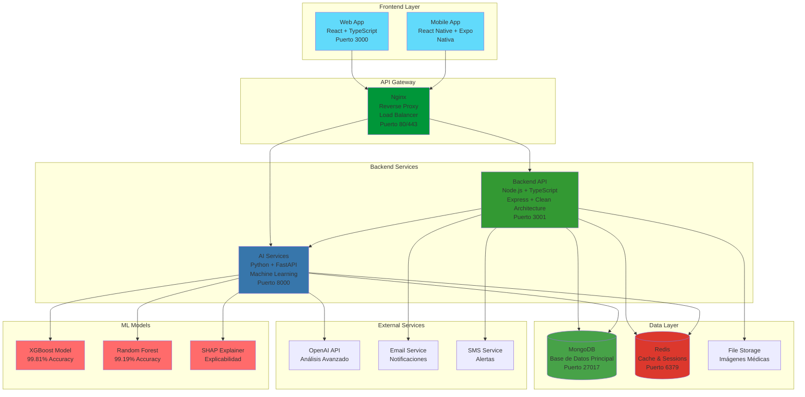
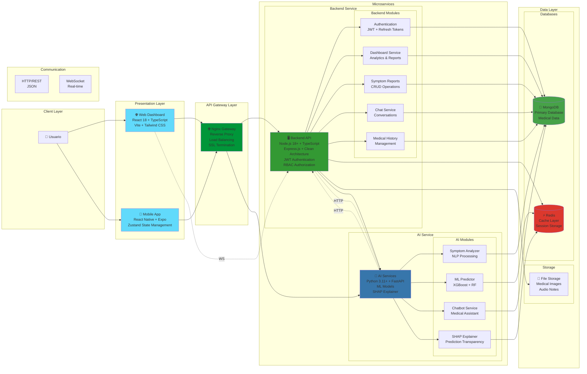
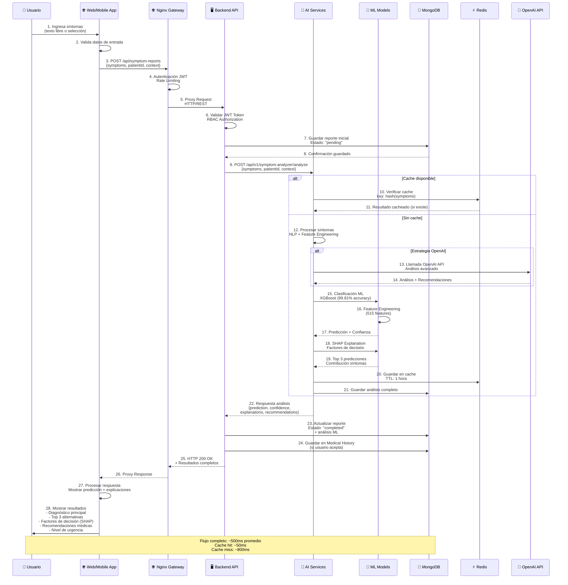
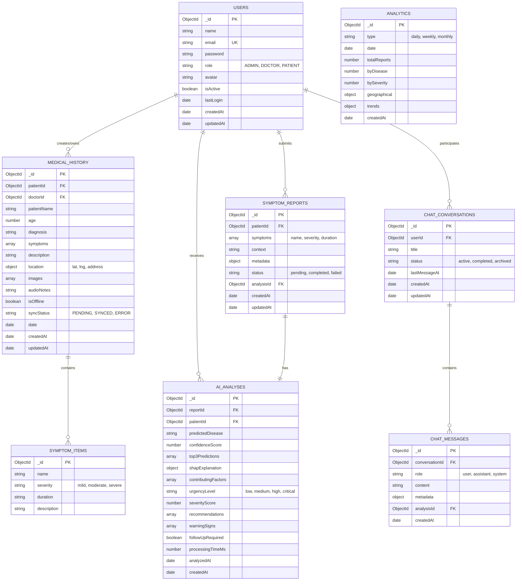
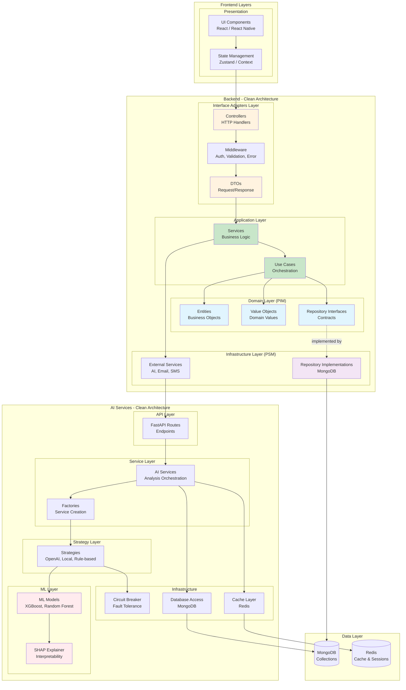
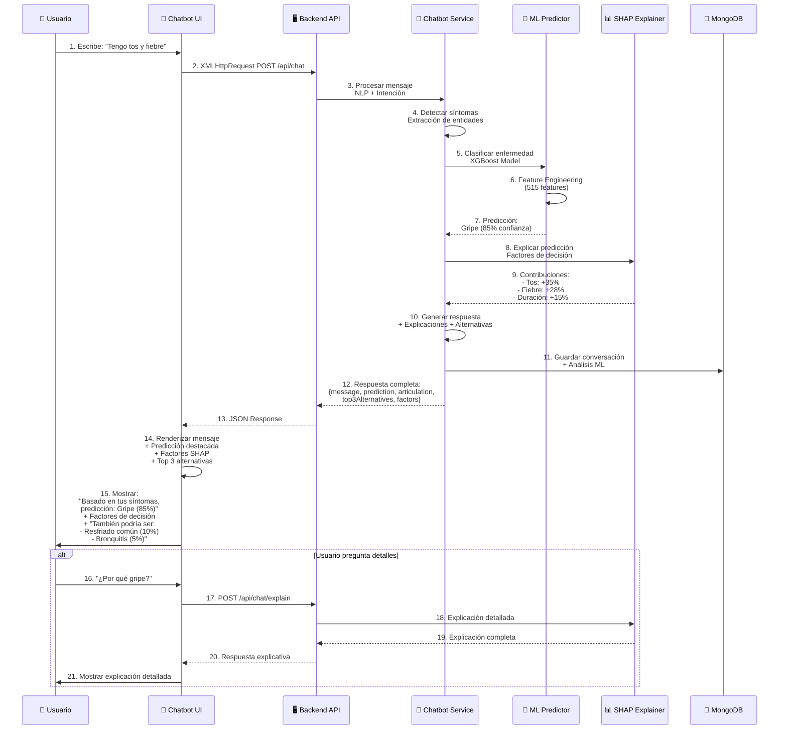
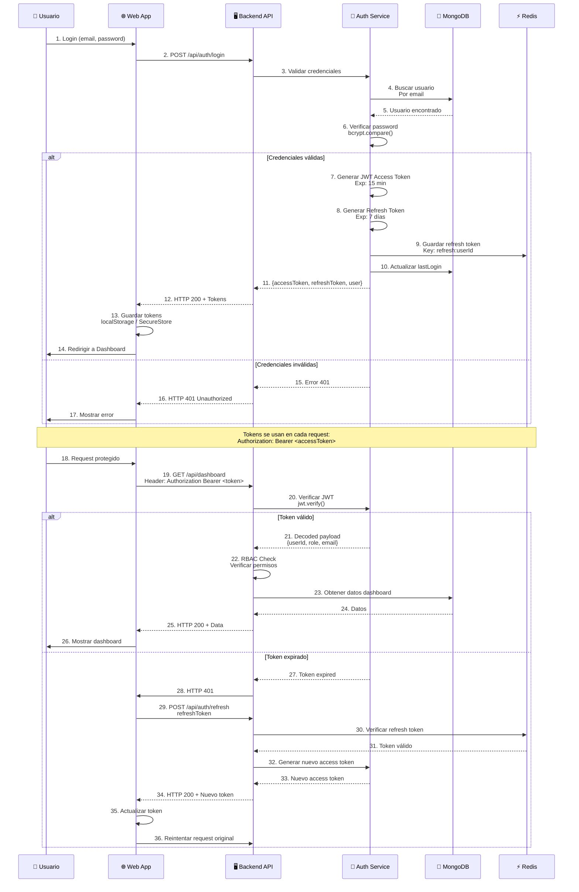

# 📊 Diagramas Mermaid - Sistema RespiCare

Este documento contiene los diagramas arquitectónicos principales del sistema RespiCare en formato Mermaid.

---

## 1. 🏗️ Diagrama de Arquitectura General

---

## 2. 🔄 Diagrama de Microservicios

---

## 3. 🔄 Diagrama de Flujo de Datos - Análisis de Síntomas

---

## 4. 💾 Diagrama de Base de Datos - MongoDB

---

## 5. 📊 Diagrama de Arquitectura en Capas (Clean Architecture)

---

## 6. 🎯 Diagrama de Flujo - Chatbot Médico con ML

---

## 7. 🔐 Diagrama de Flujo - Autenticación y Autorización

---

## 📝 Notas sobre los Diagramas

### Diagrama de Arquitectura
- Muestra la arquitectura general del sistema con todas las capas
- Incluye servicios externos y modelos ML
- Colores diferenciados por tipo de componente

### Diagrama de Microservicios
- Detalla los dos microservicios principales (Backend y AI)
- Muestra módulos internos de cada servicio
- Incluye tipos de comunicación (HTTP, WebSocket)

### Diagrama de Flujo de Datos
- Secuencia completa desde ingreso de síntomas hasta resultado
- Incluye cache y optimizaciones
- Muestra tiempos estimados de procesamiento

### Diagrama de Base de Datos
- Modelo entidad-relación completo
- Todas las colecciones principales de MongoDB
- Relaciones entre entidades

### Diagrama de Arquitectura en Capas
- Mapeo de Clean Architecture
- Separación PIM/PSM (Platform Independent/Specific Models)
- Flujo de dependencias correcto

### Diagrama de Chatbot con ML
- Flujo específico del chatbot médico
- Integración con ML y SHAP
- Respuestas con explicaciones

### Diagrama de Autenticación
- Flujo completo de login y autorización
- Manejo de tokens JWT y refresh tokens
- RBAC (Role-Based Access Control)

---

## 🛠️ Cómo Usar estos Diagramas

1. **En Documentación Markdown**: Estos diagramas funcionan en GitHub, GitLab, y cualquier renderizador de Mermaid
2. **En Presentaciones**: Puedes copiarlos a herramientas como:
   - Mermaid Live Editor: https://mermaid.live/
   - Draw.io (con plugin Mermaid)
   - PowerPoint/Google Slides (exportar como imagen)
3. **En LaTeX**: Usar el paquete `mermaid` para Beamer

---

## 📚 Referencias

- **Mermaid Documentation**: https://mermaid.js.org/
- **PlantUML Alternatives**: Estos diagramas reemplazan los diagramas PlantUML anteriores
- **Arquitectura del Proyecto**: Ver `readme.md` y `backend/CLEAN_ARCHITECTURE.md`

