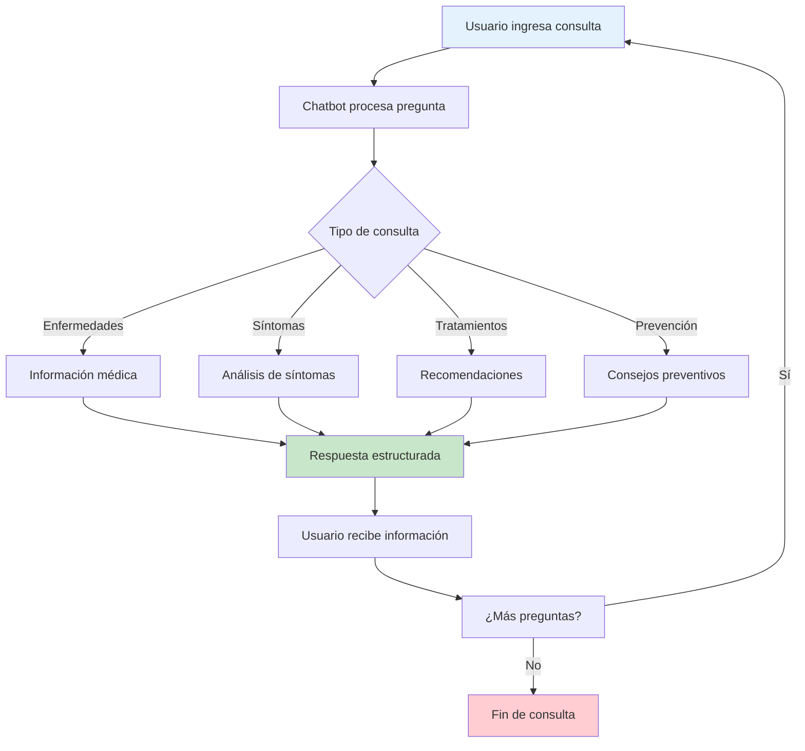

# 🤖 Guía Rápida: Chatbot Médico RespiCare

## 🔄 Flujo del Chatbot



## 🚀 Inicio Rápido

### 1. Abre la aplicación
**http://localhost:3000**

### 2. Usa el Chatbot
El chatbot está en la página principal, listo para responder tus consultas.

---

## 💬 ¿Qué puedes preguntar?

### 📚 Sobre Enfermedades (Definiciones)

```
✅ "¿Qué es el asma?"
✅ "Explícame qué es la neumonía"
✅ "Define la bronquitis"
✅ "Qué es el COVID-19?"
✅ "Háblame sobre la gripe"
✅ "Qué es EPOC?"
```

### 🤒 Sobre Síntomas

```
✅ "¿Cuáles son los síntomas del asma?"
✅ "Síntomas de neumonía"
✅ "Cómo sé si tengo COVID-19?"
✅ "Señales de bronquitis"
✅ "Síntomas de la gripe"
```

### 💊 Sobre Tratamientos

```
✅ "¿Cómo se trata el asma?"
✅ "Tratamiento para la neumonía"
✅ "Qué hacer si tengo COVID-19?"
✅ "Cómo tratar la bronquitis?"
✅ "Medicina para la gripe"
```

### 🛡️ Sobre Prevención

```
✅ "¿Cómo prevenir el asma?"
✅ "Cómo evitar la neumonía?"
✅ "Prevención del COVID-19"
✅ "Cómo no contagiarme de gripe?"
```

### 🆘 Consultas de Emergencia

```
✅ "Tengo fiebre y tos, ¿qué hago?"
✅ "Me cuesta respirar"
✅ "Tengo dolor en el pecho"
✅ "Síntomas graves, ¿debo ir al médico?"
```

---

## 🎯 Ejemplos Prácticos

### Ejemplo 1: Consulta Simple
```
TÚ: "Hola, ¿qué es el asma?"

BOT: 🫁 ASMA

El asma es una enfermedad crónica que afecta las vías 
respiratorias de los pulmones. Las vías respiratorias se 
inflaman y se estrechan, lo que dificulta la respiración.

⚠️ Importante: Esta es información general. Para un 
diagnóstico preciso, consulta con un profesional de la salud.
```

### Ejemplo 2: Consulta con Alta Urgencia
```
TÚ: "¿Cuáles son los síntomas de neumonía?"

BOT: ⚠️ 🤒 SÍNTOMAS DE NEUMONIA:

• Fiebre alta
• Tos con flema
• Dolor en el pecho
• Dificultad respiratoria
• Escalofríos
• Sudoración

⚠️ SIGNOS DE ALARMA - Buscar atención médica inmediata:
⚠️ Dificultad severa para respirar
⚠️ Labios o uñas azulados
⚠️ Confusión o desorientación
⚠️ Fiebre persistente mayor a 39°C
⚠️ Dolor torácico intenso
```

### Ejemplo 3: Análisis de Síntomas
```
TÚ: "Tengo tos seca, fiebre y me duele la garganta"

BOT: 🤒 He detectado los siguientes síntomas:

**Síntomas respiratorios:**
• tos seca

**Síntomas de fiebre:**
• fiebre

**Síntomas de dolor:**
• dolor de garganta

**Posibles condiciones relacionadas:**
• Resfriado común
• Gripe
• Bronquitis
• COVID-19

**Recomendaciones:**
• Monitorear la evolución de los síntomas
• Mantener hidratación adecuada
• Descansar lo suficiente
• Consultar médico si los síntomas empeoran
• Evitar automedicarse sin supervisión médica
```

---

## 🚨 Niveles de Urgencia

El chatbot evalúa automáticamente la urgencia de cada consulta:

| Emoji | Nivel | Significado | Acción |
|-------|-------|-------------|--------|
| 🚨 | **CRÍTICO** | Emergencia médica | Buscar atención INMEDIATA |
| ⚠️ | **ALTO** | Atención urgente | Consultar en 2 horas |
| ⚡ | **MEDIO** | Atención prioritaria | Consultar en 24 horas |
| ✅ | **BAJO** | Monitoreo regular | Consultar si persiste |

---

## ✨ Características Inteligentes

### 1. **Preguntas Rápidas**
El chatbot ofrece preguntas sugeridas para facilitar tu consulta:
- "¿Qué es el asma?"
- "¿Cuáles son los síntomas de neumonía?"
- "¿Cómo prevenir enfermedades respiratorias?"
- "¿Qué hacer si tengo dificultad para respirar?"

### 2. **Detección Automática**
El chatbot detecta automáticamente:
- ✅ Enfermedades mencionadas
- ✅ Síntomas descritos
- ✅ Tipo de consulta
- ✅ Nivel de urgencia

### 3. **Respuestas Contextuales**
Las respuestas se adaptan según tu pregunta:
- **Definiciones**: Explicación clara de la enfermedad
- **Síntomas**: Lista completa de síntomas
- **Tratamiento**: Pasos y recomendaciones
- **Prevención**: Medidas preventivas

### 4. **Sistema de Fallback**
Si el servicio de IA no está disponible, el chatbot tiene respuestas locales basadas en palabras clave.

---

## 🏥 Enfermedades Soportadas

### 1. **Asma** (Urgencia: Media)
Enfermedad crónica de las vías respiratorias

### 2. **Neumonía** (Urgencia: Alta)
Infección pulmonar grave

### 3. **Bronquitis** (Urgencia: Baja)
Inflamación de los bronquios

### 4. **COVID-19** (Urgencia: Media)
Enfermedad por coronavirus

### 5. **Gripe/Influenza** (Urgencia: Baja)
Infección viral respiratoria

### 6. **EPOC** (Urgencia: Media)
Enfermedad pulmonar obstructiva crónica

### 7. **Resfriado Común** (Urgencia: Muy Baja)
Infección viral leve

---

## 🗺️ Otras Funciones de la App

### **Mapa de Calor**
- Visualiza zonas de riesgo en Tacna, Perú
- 8 distritos monitoreados
- Filtros por nivel de severidad
- Detalles de cada zona

### **Dashboard de Servicios**
- Estado de todos los servicios
- Enlaces a herramientas de administración
- Monitoreo en tiempo real

---

## ⚠️ Importante

### Este chatbot NO sustituye:
- ❌ Consulta médica profesional
- ❌ Diagnóstico médico
- ❌ Prescripción de medicamentos
- ❌ Tratamiento médico personalizado

### Este chatbot SÍ proporciona:
- ✅ Información general sobre enfermedades
- ✅ Síntomas comunes
- ✅ Recomendaciones generales
- ✅ Orientación sobre cuándo buscar ayuda médica

---

## 🆘 Cuándo Buscar Ayuda Médica Inmediata

### Busca atención de emergencia si presentas:

🚨 **Dificultad severa para respirar**
- No puedes hablar en frases completas
- Respiración muy rápida o superficial
- Sensación de ahogo

🚨 **Signos de alerta**
- Labios o uñas azulados
- Confusión o desorientación
- Pérdida de conciencia
- Dolor intenso en el pecho

🚨 **Síntomas graves**
- Fiebre persistente > 39°C
- Tos con sangre
- Incapacidad para mantenerse despierto

**EN ESTOS CASOS:**
1. Llama al 911 o servicios de emergencia
2. Ve a la sala de emergencias más cercana
3. NO esperes ni uses solo el chatbot

---

## 💡 Consejos de Uso

### ✅ Haz preguntas claras
```
BIEN: "¿Qué es el asma y cuáles son sus síntomas?"
MAL: "asma"
```

### ✅ Describe tus síntomas
```
BIEN: "Tengo tos seca, fiebre de 38°C y dolor de garganta"
MAL: "me siento mal"
```

### ✅ Sé específico
```
BIEN: "¿Cómo prevenir la neumonía en adultos mayores?"
MAL: "prevención"
```

### ✅ Usa las preguntas rápidas
Si no sabes qué preguntar, usa las sugerencias del chatbot

---

## 🔄 Si algo no funciona

### 1. Verifica que los servicios estén activos:
```bash
docker-compose -f docker-compose.dev.yml ps
```

### 2. Revisa los logs:
```bash
docker-compose -f docker-compose.dev.yml logs ai-services --tail=50
```

### 3. Reinicia los servicios:
```bash
docker-compose -f docker-compose.dev.yml restart ai-services web
```

### 4. Abre el Dashboard:
http://localhost:3000/dashboard

---

## 📞 Contactos de Emergencia en Tacna

### Emergencias Médicas:
- **SAMU (Sistema de Atención Móvil de Urgencia):** 106
- **Emergencias Generales:** 911

### Hospitales en Tacna:
- **Hospital Hipólito Unanue:** (052) 242731
- **EsSalud Tacna:** (052) 241450
- **Clínica San Germán:** (052) 712181

---

## 🎯 Siguiente Paso

**¡Abre la aplicación y empieza a usar el chatbot!**

**http://localhost:3000**

Haz una pregunta simple para empezar, como:
- "Hola, ¿qué es el asma?"
- "¿Cuáles son los síntomas de gripe?"
- "¿Cómo prevenir enfermedades respiratorias?"

---

**Recuerda:** Este es un asistente informativo. Para emergencias médicas reales, siempre consulta con profesionales de la salud.

**¡Buena salud! 🏥💚**

