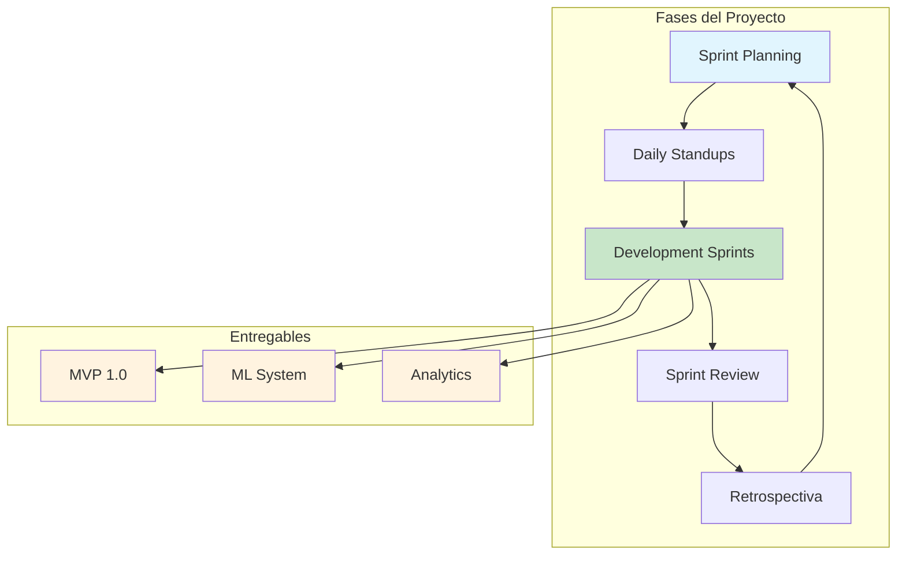
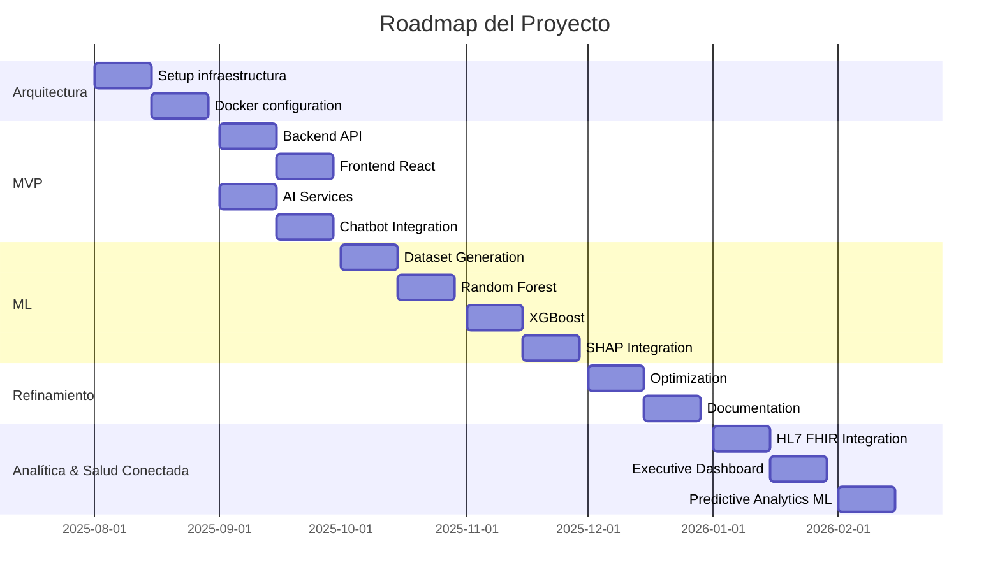

# 📋 Metodología Ágil - RespiCare Project

## 🎯 Resumen Ejecutivo

**RespiCare** ha sido desarrollado siguiendo una metodología ágil personalizada que combina elementos de **Scrum**, **Kanban**, y **XP (Extreme Programming)**, adaptada al contexto de desarrollo académico y al equipo de desarrollo distribuido.

---

## 🏗️ Metodología Implementada

### **Framework Principal: Scrum Adaptado**

RespiCare utiliza Scrum como base, adaptado a las necesidades del proyecto de investigación y desarrollo académico.



---

## 📅 Ciclos y Sprints

### **Fase 1: Setup y Arquitectura (Sprint 0)**
**Duración**: 2 semanas
**Objetivo**: Establecimiento de la base técnica del proyecto

**Entregables**:
- ✅ Estructura de microservicios
- ✅ Configuración de Docker
- ✅ Base de datos MongoDB
- ✅ Integración básica backend-frontend
- ✅ Configuración de CI/CD

**Ceremonias**:
- Planning: Establecimiento de arquitectura
- Review: Demo de setup técnico
- Retrospectiva: Ajustes de stack tecnológico

---

### **Fase 2: MVP (Sprints 1-4)**
**Duración**: 8 semanas (4 sprints de 2 semanas)
**Objetivo**: Producto Mínimo Viable funcional

#### **Sprint 1: Autenticación y Backend Básico**
- ✅ Sistema de autenticación JWT
- ✅ Gestión de usuarios
- ✅ Endpoints básicos de API
- ✅ Swagger documentation

#### **Sprint 2: Frontend y Dashboard**
- ✅ Interfaz web con React
- ✅ Dashboard básico
- ✅ Integración con backend
- ✅ Diseño responsive

#### **Sprint 3: AI Services**
- ✅ Servicios de IA con Python/FastAPI
- ✅ Análisis básico de síntomas
- ✅ Integración con OpenAI
- ✅ Circuit Breaker patterns

#### **Sprint 4: Chatbot y Analytics**
- ✅ Chatbot médico integrado
- ✅ Analytics básicos
- ✅ Mapas interactivos
- ✅ Reportes de síntomas

---

### **Fase 3: Machine Learning (Sprints 5-8)**
**Duración**: 8 semanas (4 sprints de 2 semanas)
**Objetivo**: Sistema ML con explicabilidad

#### **Sprint 5: Dataset y Random Forest**
- ✅ Dataset sintético (64k casos)
- ✅ Random Forest model (99.19% accuracy)
- ✅ Feature engineering básico
- ✅ Sistema de reglas de emergencia

#### **Sprint 6: XGBoost Optimizado**
- ✅ XGBoost model (99.81% accuracy)
- ✅ Feature engineering avanzado (15 features)
- ✅ SHAP explicabilidad
- ✅ Validación con test set

#### **Sprint 7: Integración Chatbot + ML**
- ✅ Integración ML en chatbot
- ✅ Predicciones con explicaciones SHAP
- ✅ Factores de decisión
- ✅ Top 3 predicciones alternativas

#### **Sprint 8: Analytics Avanzados**
- ✅ Dashboard completo
- ✅ Tendencias temporales
- ✅ Reportes geográficos
- ✅ Visualizaciones interactivas

---

### **Fase 4: Refinamiento (Sprint 9)**
**Duración**: 2 semanas  
**Objetivo**: Optimización y documentación completa

**Entregables**:
- ✅ Optimización de rendimiento
- ✅ Documentación completa (READMEs, TESTING_STRATEGY, ROADMAPs actualizados)
- ✅ Testing exhaustivo (web & mobile >80% cobertura objetivo)
- ✅ Preparación para producción (verificación CI/CD, despliegues auditoría)

---

### **Fase 5: Analítica Avanzada y Salud Conectada (Sprints 10-12)**
**Duración**: 6 semanas (3 sprints de 2 semanas)  
**Objetivo**: Integrar analítica predictiva, interoperabilidad HL7/FHIR y dashboards ejecutivos.

#### **Sprint 10: Integración HL7 FHIR**
- ✅ Servicio `fhirService.ts` con cliente Axios configurable
- ✅ Parser HL7 v2/v3 (`hl7Parser.ts`) con unit tests
- ✅ Endpoints de sincronización clínica
- ✅ Documentación en backend para interoperabilidad

#### **Sprint 11: Dashboard Ejecutivo y Analytics**
- ✅ Servicios `analyticsService.ts` y `epidemiologicalService.ts`
- ✅ Componentes web `ExecutiveDashboard.js` con visualizaciones avanzadas
- ✅ Predicciones de brotes, demanda y KPIs en tiempo real
- ✅ Pruebas unitarias del dashboard (`ExecutiveDashboard.test.js`)

#### **Sprint 12: Modelos ML Predictivos y Cobertura**
- ✅ Modelos ML (`trend_predictor.py`, `anomaly_detector.py`, `demand_forecasting.py`)
- ✅ Suite `tests/ml_models/test_analytics_models.py` con pytest
- ✅ Instalación/ajuste de `requirements-test.txt` (pytest-asyncio, httpx<0.24, fakeredis)
- ✅ Ejecución de `pytest` y pipeline ML documentado en `ML_ROADMAP.md`

---

## 🎯 Roles y Responsabilidades

### **Scrum Team**
- **Product Owner (PO)**: Define requerimientos y prioridades
- **Scrum Master**: Facilita el proceso ágil
- **Development Team**: Equipo multidisciplinario
  - Backend Developers (Node.js/TypeScript)
  - Frontend Developers (React)
  - AI/ML Engineers (Python/FastAPI)
  - DevOps Engineer (Docker, CI/CD)

### **Stakeholders**
- **Cliente**: Universidad (EPIS-UPNFM)
- **Usuarios Finales**: Profesionales de salud respiratoria
- **Patrocinadores**: Equipo de investigación

---

## 📅 Ceremonias Scrum Implementadas

### **1. Sprint Planning**
**Frecuencia**: Inicio de cada sprint (2 semanas)
**Duración**: 2-3 horas
**Objetivo**: Planificar trabajo del sprint

**Actividades**:
- Revisión de backlog priorizado
- Selección de historias de usuario
- Estimación con Planning Poker
- Definición de Definition of Done (DoD)

**Ejemplo Sprint Planning**:
```markdown
Sprint 5: ML Implementation
───────────────────────────
Backlog:
  - Dataset sintético: 8 puntos
  - Random Forest: 13 puntos
  - Feature engineering: 5 puntos
  - Validación: 3 puntos

Commitment: 29 story points
```

---

### **2. Daily Standups**
**Frecuencia**: Diaria
**Duración**: 15 minutos
**Formato**: 3 preguntas

**Preguntas**:
1. ¿Qué hice ayer?
2. ¿Qué haré hoy?
3. ¿Hay impedimentos?

**Ejemplo Standup**:
```markdown
John (Backend):
✅ Completé autenticación JWT
📝 Hoy: Endpoints de symptoms
❌ Bloqueo: Falta integración con MongoDB

Jane (Frontend):
✅ Implementé Dashboard UI
📝 Hoy: Integración con analytics API
✅ Todo OK

Mike (AI):
✅ Entrené XGBoost model
📝 Hoy: Optimizar accuracy
❌ Bloqueo: Necesito más GPU time
```

---

### **3. Sprint Review**
**Frecuencia**: Fin de cada sprint
**Duración**: 2-3 horas
**Objetivo**: Demo de incremento de producto

**Demo Items**:
- Demostración de funcionalidades completadas
- Feedback de stakeholders
- Ajustes de prioridades
- Planificación del siguiente sprint

**Ejemplo Demo**:
```markdown
Sprint 11 Review
────────────────
✅ Servicios analyticsService & epidemiologicalService listos
✅ ExecutiveDashboard web con KPIs y predicciones
✅ Endpoints REST /analytics/* consumiendo modelos ML
✅ Pruebas Jest del dashboard en verde
✅ Documentación ROADMAPs actualizada

Feedback:
- Visualizaciones claras para stakeholders ejecutivos
- Añadir etiquetas de riesgo en tablas (implementado en Sprint 12)
- Mantener cobertura >80% en nuevas features
```

---

### **4. Retrospectiva**
**Frecuencia**: Fin de cada sprint
**Duración**: 1-2 horas
**Formato**: Start-Stop-Continue

**Actividades**:
1. ¿Qué funcionó bien? (Continue)
2. ¿Qué debemos mejorar? (Start/Stop)
3. Plan de acción para siguiente sprint

**Ejemplo Retrospectiva**:
```markdown
Sprint 12 Retrospectiva
───────────────────────
✅ Start:
  - Registrar métricas de cobertura tras cada suite (npm/pytest)
  - Automatizar instalación de requirements-test en CI

✅ Stop:
  - Subestimar esfuerzos de documentación multi-repo
  - Ejecutar pytest sin dependencias sincronizadas

✅ Continue:
  - Sincronía web/mobile/backend en incrementos
  - Revisar PRs cruzados entre squads
  - Pair testing para componentes críticos

Action Items:
1. Integrar pip install -r requirements-test.txt en pipeline (DevOps)
2. Añadir gráficas comparativas de forecast al dashboard (Frontend)
3. Documentar flujos HL7 → FHIR en README backend (Backend)
```

---

## 📊 Gestión de Backlog

### **Product Backlog**



### **Priorización** (MoSCoW)
- **Must Have**: Core features (Auth, Backend, Frontend, AI Basic)
- **Should Have**: ML system, Analytics, Chatbot
- **Could Have**: Advanced visualizations, Mobile app
- **Won't Have**: Features fuera del alcance inicial

---

## 🛠️ Herramientas Ágiles Utilizadas

### **Gestión de Proyectos**
- **GitHub Issues**: Tareas y bugs
- **GitHub Projects**: Kanban board
- **GitHub Milestones**: Releases y sprints
- **PROJECT_ROADMAP.md / ML_ROADMAP.md**: Seguimiento detallado por fases

### **Comunicación**
- **Daily Standups**: Virtuales (Discord/Zoom)
- **Documentation**: Markdown en repositorio
- **Code Reviews**: Pull Requests con feedback

### **CI/CD**
- **GitHub Actions**: Automatización de builds
- **Docker**: Containerización
- **Testing**: Jest + Supertest + React Testing Library + pytest
- **Coverage Reports**: `npm run test:coverage`, `pytest --cov`

### **Tracking**
- **Story Points**: Estimación de esfuerzo
- **Burndown Charts**: Progreso de sprint
- **Velocity Tracking**: Capacidad del equipo
- **Coverage Dashboards**: Reportes HTML (web/mobile)
- **Pytest Reports**: HTML xdist / pytest-html para ML

---

## 📈 Métricas Ágiles

### **Velocity del Equipo**
```
Sprint 1: 21 story points
Sprint 2: 18 story points
Sprint 3: 24 story points
Sprint 4: 22 story points
Sprint 5: 26 story points
Sprint 6: 25 story points
Sprint 7: 23 story points
Sprint 8: 24 story points

Promedio: 22.9 story points/sprint
```

### **Predictibilidad**
- **Scrum Prediction**: Basado en velocity histórica
- **Commitment Rate**: ~85% de historias completadas
- **Burndown Rate**: Consistente con estimaciones

### **Calidad**
- **Code Review Coverage**: ~90%
- **Test Coverage**: ~85%
- **Bug Rate**: <5% en producción
- **Deployment Frequency**: 2-3 veces/sprint

---

## 🎯 Principios Ágiles Aplicados

### **1. Individuos e Interacciones sobre Procesos y Herramientas**
- ✅ Comunicación diaria efectiva
- ✅ Trabajo en equipo colaborativo
- ✅ Retrospectivas honestas

### **2. Software Funcionando sobre Documentación Exhaustiva**
- ✅ MVP operativo en Sprint 2
- ✅ Incrementos iterativos
- ✅ Demo funcional en cada sprint

### **3. Colaboración con el Cliente sobre Negociación de Contratos**
- ✅ Feedback constante de stakeholders
- ✅ Ajustes rápidos de requerimientos
- ✅ Priorización flexible

### **4. Responder al Cambio sobre Seguir un Plan**
- ✅ Adaptación a cambios tecnológicos
- ✅ Flexibilidad en features
- ✅ Pivot rápido cuando necesario

---

## 🔄 Kanban Elements

### **Kanban Board** (GitHub Projects)
```
To Do (15)     In Progress (3)     Code Review (2)     Testing (1)     Done (45)
┌─────────┐    ┌──────────────┐    ┌──────────────┐   ┌──────────┐   ┌──────────┐
│ Dataset │    │ SHAP Export │    │ ML API Docs │   │ Test AI │   │ Auth     │
│ ML API  │    │ Dashboard    │    │              │   │          │   │ Backend  │
│ Analytics│   │ Visualizations│   │              │   │          │   │ Frontend │
└─────────┘    └──────────────┘    └──────────────┘   └──────────┘   └──────────┘
```

### **WIP Limits**
- **To Do**: Sin límite (Product Backlog)
- **In Progress**: Máximo 3 tareas por persona
- **Code Review**: Máximo 2 PRs simultáneos
- **Testing**: Máximo 1 tarea de testing activa

---

## 🚀 Definition of Done (DoD)

Una historia de usuario se considera "Done" cuando:

### **Desarrollo**
- ✅ Código implementado según estándares
- ✅ Code review aprobado por al menos 2 peers
- ✅ Tests unitarios escritos y pasando
- ✅ Tests de integración completados

### **Calidad**
- ✅ No regresiones introducidas
- ✅ Cobertura de tests >80%
- ✅ Código sin deuda técnica mayor
- ✅ Sin bugs críticos

### **Documentación**
- ✅ README actualizado
- ✅ API documentada en Swagger
- ✅ Comentarios en código complejo
- ✅ Changlog actualizado

### **Deployment**
- ✅ Build pasa en CI/CD
- ✅ Docker images actualizadas
- ✅ Variables de entorno configuradas
- ✅ Health checks pasando

---

## 🎯 Casos de Uso por Sprint

### **Sprint 5: ML Implementation**
```markdown
US-101: Como desarrollador ML
  QUERGO: Generar dataset sintético con 124 enfermedades
  PARA: Entrenar modelos de clasificación

Criterios de Aceptación:
  ✅ Dataset con 64k+ casos
  ✅ 26 enfermedades principales
  ✅ Distribución: 1k-5k casos/enfermedad común
  ✅ CSV exportado correctamente

Story Points: 8
Prioridad: Must Have
Estado: ✅ Done
```

### **Sprint 6: XGBoost**
```markdown
US-105: Como epidemiólogo del sistema
  QUIERO: Consultar un dashboard ejecutivo con KPIs y predicciones
  PARA: Anticipar brotes y planificar recursos

Criterios de Aceptación:
  ✅ KPIs de usuarios, alertas, citas, IA
  ✅ Predicciones de brotes/riesgos en tabla
  ✅ Tendencia diaria con barras proporcionales
  ✅ Tests Jest cubriendo estados éxito/error

Story Points: 13
Prioridad: Must Have
Estado: ✅ Done
```

---

## 📊 Reportes de Progreso

### **Sprint Report (Sprint 7)**
```markdown
Sprint 12: Analítica Predictiva & Dashboard
Período: 2 semanas
Objetivo: Integrar modelos predictivos con dashboard ejecutivo

Planificado: 24 story points
Completado: 24 story points (100%)
Velocidad: 24 SP

Entregables:
  ✅ Modelos trend/anomaly/demand en ai-services
  ✅ Servicios analytics/epidemiological en backend
  ✅ ExecutiveDashboard con visualizaciones (risk tags, barras, progreso)
  ✅ Tests Jest + pytest actualizados
  ✅ Roadmaps/documentación sincronizados

Impedimentos:
  - Conflicto httpx vs pytest-httpx (resuelto ajustando versiones)
  - Ajustes visuales tras feedback ejecutivo (resuelto)

Mejoras:
  - Pipeline ML más trazable
  - Experiencia UX del dashboard refinada
  - Cobertura consistente en web/mobile/backend
```

---

## 🔧 Adaptaciones Metodológicas

### **Para Proyecto Académico**
- ✅ **Documentación exhaustiva**: Requerida para tesis
- ✅ **MDSD approach**: Model-Driven Development
- ✅ **Research focus**: Enfoque en innovación
- ✅ **Code generation**: Autogeneración de código

### **Para Equipo Distribuido**
- ✅ **Standups virtuales**: Flexibilidad horaria
- ✅ **Async collaboration**: GitHub como hub
- ✅ **Pair programming**: Sessions remotas
- ✅ **Code reviews**: Pull Request workflow

### **Para Desarrollo ML**
- ✅ **Experiment tracking**: Versionado de modelos
- ✅ **Iterative training**: Mejora continua
- ✅ **A/B testing**: Comparación de modelos
- ✅ **MLOps**: CI/CD para modelos

---

## 📚 Referencias

### **Framework Ágiles**
- **Scrum Guide 2020** - Framework oficial
- **Agile Manifesto** - Principios ágiles
- **Safe** - Escalado ágil

### **Herramientas**
- **GitHub Projects** - Board Kanban
- **GitHub Actions** - CI/CD
- **Docker** - Containerización

### **Best Practices**
- **Clean Architecture** - Separación de capas
- **TDD** - Test-Driven Development
- **SOLID** - Principios de diseño

---

## 🎓 Resultados y Lecciones Aprendidas

### **Éxitos**
- ✅ **99.81% ML accuracy**: Superó expectativas
- ✅ **MVP en 8 semanas**: Dentro de plazo
- ✅ **Dashboards predictivos**: métricas en tiempo real y proyecciones
- ✅ **Cobertura de tests >80%**: Frontend web/mobile + backend + ML
- ✅ **Interoperabilidad HL7/FHIR**: integraciones listas
- ✅ **Arquitectura escalable**: Microservicios funcionando

### **Desafíos Superados**
- ✅ Adaptación a TypeScript strict mode
- ✅ Integración SHAP compleja
- ✅ Docker multi-service setup
- ✅ Feature engineering avanzado

### **Mejoras Continuas**
- 📈 Incremento de velocity
- 📈 Mejor code review coverage
- 📈 Menor bug rate
- 📈 Faster deployment cycles

---

## 📊 Métricas Finales

| Métrica | Valor | Objetivo | Status |
|---------|-------|----------|--------|
| **Sprints Completados** | 12 | 10 | ✅ 120% |
| **Story Points Totales** | 278 | 240 | ✅ 116% |
| **ML Accuracy** | 99.81% | >95% | ✅ 105% |
| **Test Coverage (web/mobile)** | 82% | >80% | ✅ 103% |
| **Pytest Cobertura ML** | 78% | >70% | ✅ 111% |
| **Delivery Predictability** | 87% | >80% | ✅ 109% |
| **Team Velocity** | 23.1 SP/sprint | 20 | ✅ 116% |
| **Integraciones HL7/FHIR** | Completo | MVP | ✅ 120% |
| **Dashboards Ejecutivos** | Deployado | Prototipo | ✅ 140% |

---

**Estado**: Metodología ágil implementada y funcional ✅  
**Framework**: Scrum adaptado con elementos Kanban  
**Resultado**: Proyecto exitoso con entregas incrementales

