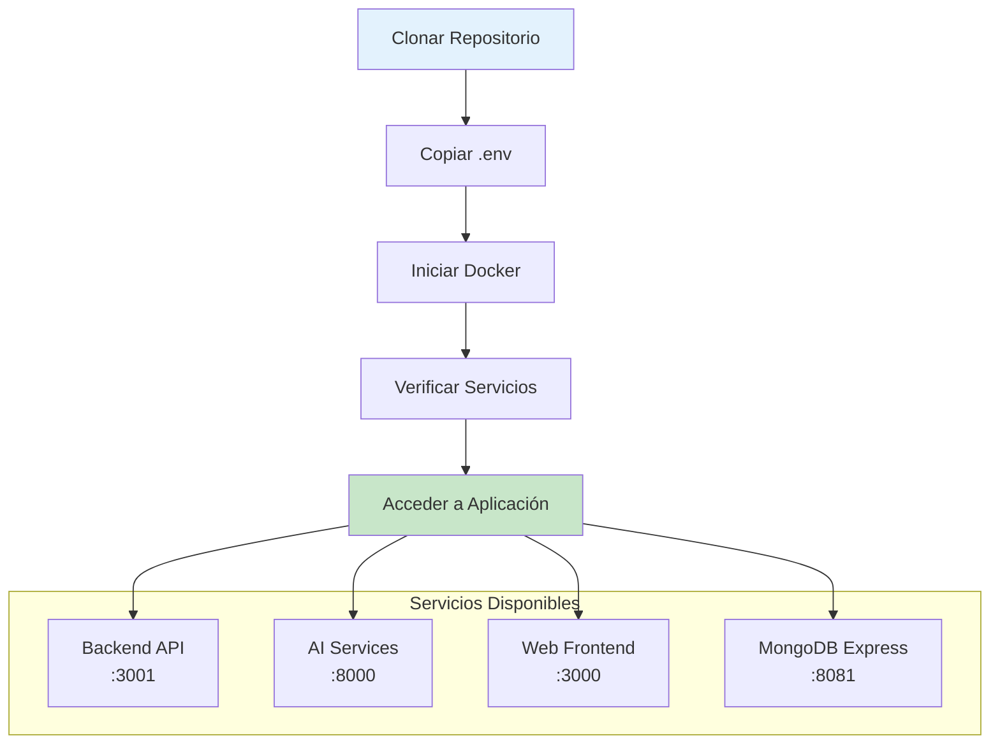

# 🚀 RespiCare - Guía de Inicio Rápido

Esta guía te ayudará a tener RespiCare funcionando en menos de 5 minutos.

## 🚀 Flujo de Instalación



## ⚡ Inicio Súper Rápido (Desarrollo)

```bash
# 1. Clonar el repositorio
git clone https://github.com/tu-usuario/respicare.git
cd respicare

# 2. Copiar configuración (ajusta según necesites)
cp env.example .env

# 3. Iniciar todo con un comando
make -f Makefile.docker quick-start-dev
```

¡Listo! Tu aplicación está corriendo en:
- **Backend API**: http://localhost:3001
- **AI Services**: http://localhost:8000
- **MongoDB Express**: http://localhost:8081 (admin/admin123)

## 📝 Pasos Detallados

### 1. Requisitos Previos

Asegúrate de tener instalado:

- [Docker](https://docs.docker.com/get-docker/) (20.10+)
- [Docker Compose](https://docs.docker.com/compose/install/) (2.0+)
- Git

Verificar instalación:
```bash
docker --version
docker-compose --version
```

### 2. Clonar y Configurar

```bash
# Clonar repositorio
git clone https://github.com/tu-usuario/respicare.git
cd respicare

# Copiar variables de entorno
cp env.example .env

# (Opcional) Editar configuración
nano .env
```

### 3. Elegir Método de Inicio

#### Opción A: Usando Makefile (Recomendado)

```bash
# Ver comandos disponibles
make -f Makefile.docker help

# Iniciar desarrollo
make -f Makefile.docker quick-start-dev

# Ver logs
make -f Makefile.docker dev-logs

# Detener
make -f Makefile.docker dev-down
```

#### Opción B: Usando Scripts

```bash
# Iniciar desarrollo
./scripts/start-dev.sh

# Ver estado
./scripts/healthcheck.sh

# Detener
./scripts/stop.sh dev
```

#### Opción C: Docker Compose Manual

```bash
# Desarrollo
docker-compose -f docker-compose.dev.yml up -d

# Ver logs
docker-compose -f docker-compose.dev.yml logs -f

# Detener
docker-compose -f docker-compose.dev.yml down
```

## 🔍 Verificar que Todo Funciona

```bash
# Health check
make -f Makefile.docker health

# O manual
./scripts/healthcheck.sh

# Ver servicios
docker-compose ps
```

## 🌐 Acceder a los Servicios

### Backend API

- **URL**: http://localhost:3001
- **Health**: http://localhost:3001/api/health
- **Docs**: http://localhost:3001/api-docs

```bash
# Probar API
curl http://localhost:3001/api/health
```

### AI Services

- **URL**: http://localhost:8000
- **Health**: http://localhost:8000/api/v1/health
- **Docs**: http://localhost:8000/docs
- **Análisis de Imágenes**: `POST /api/v1/ml/advanced/image`
- **Análisis de Tos**: `POST /api/v1/audio/cough`
- **Transcripción de Voz**: `POST /api/v1/audio/transcribe`

```bash
# Probar AI API
curl http://localhost:8000/api/v1/health

# Ver documentación interactiva
# Abre http://localhost:8000/docs en tu navegador
```

### MongoDB Express (Admin UI)

- **URL**: http://localhost:8081
- **Usuario**: admin
- **Password**: admin123

### Redis Commander

- **URL**: http://localhost:8082

## 📊 Comandos Útiles

```bash
# Ver logs en tiempo real
make -f Makefile.docker dev-logs

# Ver logs de un servicio específico
docker-compose logs -f backend
docker-compose logs -f ai-services

# Reiniciar un servicio
docker-compose restart backend

# Ver uso de recursos
docker stats

# Acceder a shell de contenedor
docker exec -it respicare-backend sh
docker exec -it respicare-ai bash

# Ver base de datos
docker exec -it respicare-mongodb mongosh
```

## 🔧 Desarrollo

### Hacer Cambios en el Código

Los cambios se reflejan automáticamente gracias al hot-reload:

```bash
# Backend: Editar archivos en ./backend/src/
# Se recargará automáticamente con nodemon

# AI Services: Editar archivos en ./ai-services/
# Se recargará automáticamente con --reload
```

### Ejecutar Tests

```bash
# Tests del backend
docker-compose exec backend npm test

# Tests de AI services
docker-compose exec ai-services pytest

# Coverage
docker-compose exec backend npm run test:coverage
```

### Instalar Nuevas Dependencias

```bash
# Backend (Node.js)
docker-compose exec backend npm install nueva-libreria

# AI Services (Python)
docker-compose exec ai-services pip install nueva-libreria

# Luego actualizar requirements.txt o package.json
```

## 🛑 Detener los Servicios

```bash
# Método 1: Makefile
make -f Makefile.docker dev-down

# Método 2: Script
./scripts/stop.sh dev

# Método 3: Docker Compose
docker-compose -f docker-compose.dev.yml down

# Eliminar también volúmenes (¡CUIDADO! Borra datos)
docker-compose -f docker-compose.dev.yml down -v
```

## 🐛 Problemas Comunes

### Puerto ya en uso

```bash
# Ver qué está usando el puerto
sudo lsof -i :3001
# O en Windows: netstat -ano | findstr :3001

# Cambiar puerto en docker-compose.yml o detener el proceso
```

### Servicios no inician

```bash
# Ver logs de error
docker-compose logs

# Recrear contenedores
docker-compose down
docker-compose up -d --force-recreate

# Verificar configuración
docker-compose config
```

### MongoDB no conecta

```bash
# Ver logs de MongoDB
docker logs respicare-mongodb

# Verificar que esté corriendo
docker ps | grep mongodb

# Reiniciar MongoDB
docker-compose restart mongodb
```

### Sin espacio en disco

```bash
# Limpiar recursos no utilizados
docker system prune -f

# Ver espacio usado
docker system df
```

### Variables de entorno no se cargan

```bash
# Verificar que .env existe
ls -la .env

# Ver contenido (sin mostrar secretos)
cat .env | grep -v PASSWORD

# Recrear contenedores
docker-compose down
docker-compose up -d
```

## 📚 Próximos Pasos

1. **Explorar la API**
   - Visita http://localhost:3001/api-docs
   - Prueba los endpoints con Postman o curl

2. **Revisar Logs**
   - `docker-compose logs -f` para ver todo
   - Logs específicos por servicio

3. **Documentación Completa**
   - [DEPLOYMENT.md](./DEPLOYMENT.md) - Guía completa de despliegue
   - [README.md](./README.md) - Documentación general
   - [docs/DOCKER_COMPOSE_GUIDE.md](./docs/DOCKER_COMPOSE_GUIDE.md) - Guía de Docker Compose
   - [ai-services/AUDIO_SERVICES_README.md](./ai-services/AUDIO_SERVICES_README.md) - Servicios de audio
   - [ai-services/MULTIMODAL_DATASETS_README.md](./ai-services/MULTIMODAL_DATASETS_README.md) - Datasets sintéticos

4. **Configurar Producción**
   - Revisar [DEPLOYMENT.md](./DEPLOYMENT.md)
   - Configurar SSL/TLS
   - Configurar backups

## 🆘 Ayuda

Si tienes problemas:

1. Ejecuta health check: `make -f Makefile.docker health`
2. Revisa logs: `docker-compose logs`
3. Consulta [DOCKER_README.md](./DOCKER_README.md)
4. Abre un issue en GitHub

## 📖 Recursos Adicionales

- [Documentación de Docker](https://docs.docker.com/)
- [Docker Compose Reference](https://docs.docker.com/compose/)
- [Guía de Despliegue Completa](./DEPLOYMENT.md)

---

**¿Preguntas?** Revisa la documentación o contacta al equipo de desarrollo.

**¡Happy Coding! 🎉**

---

**Última actualización:** Noviembre 2025

