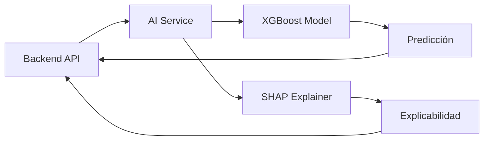

# 🏥 RespiCare Backend API

Backend API completo para el sistema de gestión de enfermedades respiratorias RespiCare Tacna.

## 🚀 Características

### ✅ **Funcionalidades Implementadas**

#### **1. Autenticación y Autorización**
- ✅ Registro de usuarios (pacientes, doctores, administradores)
- ✅ Login con JWT y refresh tokens
- ✅ Middleware de autenticación robusto
- ✅ Control de roles y permisos
- ✅ Cambio de contraseña seguro
- ✅ Desactivación de cuentas
- ✅ Gestión de usuarios (Admin)

#### **2. Gestión de Historias Médicas**
- ✅ CRUD completo de historias médicas
- ✅ Sincronización offline
- ✅ Búsqueda y filtros avanzados (por fecha, ubicación, paciente)
- ✅ Validación de datos con Joi
- ✅ Exportación de datos (JSON, CSV, PDF)
- ✅ Estadísticas y reportes

#### **3. Análisis de Síntomas con IA** 🤖
- ✅ Integración con servicios de IA (Python/FastAPI)
- ✅ Análisis automático de síntomas con Machine Learning
- ✅ Clasificación de severidad y urgencia
- ✅ Recomendaciones médicas inteligentes
- ✅ Tendencias de síntomas temporales
- ✅ Identificación de signos de alarma
- ✅ Historial de análisis de síntomas
- ✅ Estadísticas de síntomas

#### **4. Dashboard y Analytics** 📊
- ✅ Dashboard personalizado por rol (Admin, Doctor, Paciente)
- ✅ Estadísticas en tiempo real
- ✅ Métricas de crecimiento
- ✅ Análisis de tendencias temporales (7d, 30d, 90d, 1año)
- ✅ Reportes de enfermedades por tipo
- ✅ Reportes geográficos por distrito
- ✅ Gráficos interactivos

#### **5. Analytics Avanzados** (Nuevo)
- ✅ Tendencias temporales de síntomas
- ✅ Reportes de enfermedades por tipo
- ✅ Analytics geográficos por ubicación
- ✅ Análisis de síntomas más frecuentes
- ✅ Clasificación por severidad (bajo, medio, alto, severo)
- ✅ Dashboard ejecutivo (KPIs de alertas, IA, citas, satisfacción)
- ✅ Predicción temprana de brotes epidemiológicos
- ✅ Endpoints REST para analytics predictivo (`/api/v1/analytics/*`)

#### **6. Gestión de Archivos**
- ✅ Subida de imágenes médicas
- ✅ Grabación de notas de audio
- ✅ Procesamiento automático de imágenes
- ✅ Compresión y optimización
- ✅ Gestión de almacenamiento

#### **7. Exportación de Datos**
- ✅ Exportación en múltiples formatos (JSON, CSV, PDF)
- ✅ Filtros avanzados de exportación
- ✅ Estadísticas de usuarios
- ✅ Reportes personalizados

#### **8. Seguridad Avanzada**
- ✅ Encriptación de contraseñas con bcrypt
- ✅ Rate limiting por IP
- ✅ Sanitización de datos (XSS, NoSQL injection)
- ✅ Validación de entrada robusta
- ✅ Headers de seguridad con Helmet
- ✅ CORS configurado

#### **9. Chat y Conversaciones**
- ✅ Sistema de chat con servicio de IA
- ✅ Conversaciones persistentes
- ✅ Análisis de mensajes con ML
- ✅ Clasificación automática de intención
- ✅ Respuestas contextualizadas

#### **10. Base de Datos**
- ✅ Modelos MongoDB con Mongoose
- ✅ Índices optimizados para consultas
- ✅ Validaciones a nivel de esquema
- ✅ Middleware de encriptación
- ✅ Relaciones entre entidades
- ✅ Modelos: User, MedicalHistory, SymptomReport, ChatConversation, AIAnalysis

#### **11. Documentación API**
- ✅ Swagger/OpenAPI completa en `/api-docs`
- ✅ Documentación interactiva
- ✅ Esquemas de datos detallados
- ✅ Ejemplos de uso

#### **12. Utilidades de Desarrollo**
- ✅ Scripts de seeding de datos
- ✅ Logging estructurado con Winston
- ✅ Manejo de errores centralizado
- ✅ Validación de datos robusta con Joi
- ✅ TypeScript con configuración optimizada para CI/CD

#### **13. Integraciones HL7 / FHIR** *(En progreso)*
- ✅ Cliente FHIR configurable con soporte CRUD, búsqueda y bundles transaccionales
- ✅ Parser HL7 v2 (segmentos MSH/PID/OBR/OBX) y conversor a recursos FHIR `Observation`
- ✅ Soporte HL7 v3 (XML) mediante `xml2js`
- ✅ Pruebas unitarias dedicadas (`npm run test -- fhirService`, `npm run test -- hl7Parser`)
- ⏳ Publicación de endpoints REST externos y flujos de interoperabilidad hospitalaria

## 🏗️ Arquitectura Técnica

### **Stack Tecnológico:**
- **Node.js** + **TypeScript** - Runtime y tipado
- **Express.js** - Framework web
- **MongoDB** + **Mongoose** - Base de datos
- **JWT** - Autenticación
- **Joi** - Validación de datos
- **Winston** - Logging
- **Helmet** - Seguridad
- **Axios** - Cliente HTTP para IA y FHIR
- **Multer** - Manejo de archivos
- **Sharp** - Procesamiento de imágenes
- **PDFKit** - Generación de PDFs
- **CSV-Writer** - Exportación CSV
- **xml2js** - Procesamiento de mensajes HL7 v3 (XML)
- **Swagger** - Documentación API

### **Estructura del Proyecto:**
```
backend/
├── src/
│   ├── controllers/         # Controladores de API
│   │   ├── authController.ts
│   │   ├── medicalHistoryController.ts
│   │   ├── symptomAnalyzerController.ts
│   │   ├── dashboardController.ts
│   │   ├── fileUploadController.ts
│   │   └── exportController.ts
│   ├── models/             # Modelos de MongoDB
│   │   ├── User.ts
│   │   ├── MedicalHistory.ts
│   │   └── AIAnalysis.ts
│   ├── middleware/         # Middleware personalizado
│   │   ├── auth.ts
│   │   ├── errorHandler.ts
│   │   └── validation.ts
│   ├── routes/             # Rutas de API
│   │   ├── authRoutes.ts
│   │   ├── medicalHistoryRoutes.ts
│   │   ├── symptomAnalyzerRoutes.ts
│   │   ├── dashboardRoutes.ts
│   │   ├── fileUploadRoutes.ts
│   │   └── exportRoutes.ts
│   ├── services/           # Servicios de negocio
│   │   ├── aiIntegration.ts
│   │   ├── fileUploadService.ts
│   │   ├── exportService.ts
│   │   ├── analyticsService.ts
│   │   └── epidemiologicalService.ts
│   ├── validators/         # Validadores Joi
│   │   ├── authValidators.ts
│   │   └── medicalHistoryValidators.ts
│   ├── utils/              # Utilidades
│   │   ├── AppError.ts
│   │   ├── asyncHandler.ts
│   │   └── logger.ts
│   ├── config/             # Configuración
│   │   ├── config.ts
│   │   └── swagger.ts
│   ├── types/              # Tipos TypeScript
│   │   └── index.ts
│   ├── scripts/            # Scripts de utilidad
│   │   └── seed.ts
│   └── index.ts            # Punto de entrada
├── logs/                   # Archivos de log
├── uploads/                # Archivos subidos
│   ├── images/            # Imágenes médicas
│   └── audio/             # Notas de audio
└── package.json            # Dependencias
```

## 🚀 Instalación y Configuración

### **Prerrequisitos:**
- Node.js >= 18.0.0
- MongoDB >= 6.0
- Redis >= 6.0 (opcional)

### **Instalación:**
```bash
# Instalar dependencias
npm install

# Copiar archivo de configuración
cp env.example .env

# Editar variables de entorno
nano .env

# Compilar TypeScript
npm run build

# Ejecutar en desarrollo
npm run dev

# Ejecutar en producción
npm start
```

### **Variables de Entorno:**
```bash
# Servidor
NODE_ENV=development
PORT=3001
HOST=localhost

# Base de datos
MONGODB_URI=mongodb://localhost:27017/respicare
REDIS_URL=redis://localhost:6379

# JWT
JWT_SECRET=your_super_secret_jwt_key_here
JWT_EXPIRE=7d
JWT_REFRESH_SECRET=your_refresh_secret_key_here
JWT_REFRESH_EXPIRE=30d

# Seguridad
BCRYPT_ROUNDS=12
RATE_LIMIT_WINDOW_MS=900000
RATE_LIMIT_MAX_REQUESTS=100
INTERNAL_SERVICE_TOKENS=service-token-1,service-token-2
CRITICAL_ALERT_ROLES=doctor,admin
PUSH_PROVIDER=expo
PUSH_API_KEY=your_push_api_key
PUSH_PROJECT_ID=your_push_project_id
DRUG_INTERACTION_API_URL=https://api.drugs.com/v1
DRUG_INTERACTION_API_KEY=your_api_key_here

# Jobs de alertas
ALERTS_SCHEDULED_INTERVAL_MS=30000
ALERTS_PENDING_INTERVAL_MS=45000

# CORS
CORS_ORIGINS=http://localhost:3000,http://localhost:3001
```

### **Scripts de Seeding**

```bash
# Poblar usuarios e historias médicas de ejemplo
npm run seed

# Generar alertas y métricas para el dashboard de alertas
npm run seed:alerts
```

## 📚 API Endpoints

### **Autenticación (`/api/v1/auth`)**
```http
POST   /register          # Registrar usuario
POST   /login             # Iniciar sesión
POST   /refresh-token     # Refrescar token
POST   /logout            # Cerrar sesión
GET    /profile           # Obtener perfil
PUT    /profile           # Actualizar perfil
PUT    /change-password   # Cambiar contraseña
PUT    /deactivate        # Desactivar cuenta
GET    /users             # Listar usuarios (admin)
GET    /stats             # Estadísticas (admin)
```

### **Historias Médicas (`/api/v1/medical-histories`)**
```http
POST   /                  # Crear historia médica
GET    /                  # Listar historias médicas
GET    /:id               # Obtener historia por ID
PUT    /:id               # Actualizar historia
DELETE /:id               # Eliminar historia
POST   /sync              # Sincronizar offline
GET    /stats             # Estadísticas
GET    /top-diagnoses     # Diagnósticos más comunes
GET    /age-stats         # Estadísticas por edad
GET    /location          # Buscar por ubicación
GET    /date-range        # Buscar por fechas
```

### **Análisis de Síntomas (`/api/v1/symptom-analyzer`)**
```http
POST   /analyze           # Analizar síntomas con IA
GET    /trends/:patientId # Obtener tendencias de síntomas
GET    /recommendations   # Obtener recomendaciones generales
GET    /status            # Estado del servicio de IA
GET    /history/:patientId # Historial de análisis
GET    /statistics/:patientId # Estadísticas de síntomas
```

### **Dashboard (`/api/v1/dashboard`)**
```http
GET    /admin             # Dashboard de administrador
GET    /doctor            # Dashboard de doctor
GET    /patient           # Dashboard de paciente
GET    /health            # Estado del sistema
```

### **Analytics (`/api/analytics`)** (Nuevo)
```http
GET    /temporal-trends   # Tendencias temporales de síntomas
GET    /disease-reports    # Reportes por tipo de enfermedad
GET    /geographic-data    # Datos geográficos de síntomas
GET    /symptom-summary    # Resumen de síntomas más frecuentes
```

### **Gestión de Archivos (`/api/v1/upload`)**
```http
POST   /medical-files     # Subir archivos médicos
GET    /file-info/:path   # Información de archivo
DELETE /file/:path        # Eliminar archivo
GET    /stats             # Estadísticas de archivos (admin)
POST   /cleanup           # Limpiar archivos antiguos (admin)
```

### **Exportación (`/api/v1/export`)**
```http
POST   /medical-histories # Exportar historias médicas
POST   /user-statistics   # Exportar estadísticas (admin)
GET    /formats           # Formatos disponibles
GET    /history           # Historial de exportaciones
```

### **Alertas (`/api/v1/alerts`)**
```http
POST   /critical-symptom             # Crear alerta automática por síntoma crítico
POST   /medication-reminders         # Programar recordatorio de medicamento
POST   /follow-up                    # Programar seguimiento médico
POST   /doctor-notifications         # Notificar a médicos sobre casos urgentes
POST   /:alertId/acknowledge         # Reconocer una alerta como atendida
GET    /                              # Listar alertas del usuario autenticado
GET    /dashboard/summary            # Resumen global de alertas (admin)
GET    /monitoring                   # Métricas de cola Redis y fallos (admin)
POST   /admin/process                # Forzar procesamiento inmediato (admin)
```

### **Citas Médicas (`/api/v1/appointments`)**
```http
POST   /                             # Crear cita (doctor/admin/paciente con token válido)
GET    /                             # Listar citas (filtros por doctor, paciente, estado, fechas)
GET    /me/upcoming                  # Listar próximas citas del usuario autenticado
GET    /doctor/:doctorId/availability # Disponibilidad del doctor en un rango
GET    /:appointmentId               # Obtener detalle de cita
PUT    /:appointmentId               # Actualizar detalles (doctor/admin)
PATCH  /:appointmentId/cancel        # Cancelar cita (doctor/admin)
PATCH  /:appointmentId/reschedule    # Reprogramar cita (doctor/admin)
PATCH  /:appointmentId/complete      # Marcar cita como completada (doctor/admin)
```

## 🔒 Seguridad

### **Medidas Implementadas:**
- **Autenticación JWT** con refresh tokens
- **Encriptación bcrypt** para contraseñas
- **Rate limiting** por IP
- **Sanitización XSS** y NoSQL injection
- **Validación robusta** con Joi
- **Headers de seguridad** con Helmet
- **CORS** configurado
- **Logging** de seguridad

### **Validaciones:**
- **Entrada de datos** - Joi schemas
- **Contraseñas** - Patrones seguros
- **Emails** - Formato válido
- **Roles** - Enum validado
- **Fechas** - Rango válido
- **Ubicaciones** - Coordenadas válidas

## 📊 Modelos de Datos

### **User**
```typescript
{
  _id: string;
  name: string;
  email: string;
  password: string; // Encriptada
  role: 'patient' | 'doctor' | 'admin';
  avatar?: string;
  isActive: boolean;
  lastLogin?: Date;
  createdAt: Date;
  updatedAt: Date;
}
```

### **MedicalHistory**
```typescript
{
  _id: string;
  patientId: string;
  doctorId: string;
  patientName: string;
  age: number;
  diagnosis: string;
  symptoms: Symptom[];
  description?: string;
  date: Date;
  location?: {
    latitude: number;
    longitude: number;
    address: string;
  };
  images?: string[];
  audioNotes?: string;
  isOffline?: boolean;
  syncStatus: 'pending' | 'synced' | 'error';
  createdAt: Date;
  updatedAt: Date;
}
```

### **SymptomReport** (Nuevo)
```typescript
{
  _id: string;
  userId: string;
  symptoms: Array<{
    name: string;
    severity: 'low' | 'moderate' | 'high' | 'severe';
    duration: number; // en días
    description?: string;
  }>;
  location: {
    district: string;
    city: string;
    country: string;
  };
  reportedAt: Date;
  category: string;
  severity: 'low' | 'moderate' | 'high' | 'severe';
}
```

### **ChatConversation** (Nuevo)
```typescript
{
  _id: string;
  sessionId: string;
  userId: string;
  messages: Array<{
    role: 'user' | 'assistant';
    content: string;
    timestamp: Date;
    metadata?: object;
  }>;
  metadata: {
    source: string;
    language: string;
  };
  location: {
    city: string;
    country: string;
  };
  createdAt: Date;
  updatedAt: Date;
}
```

### **AIAnalysis** (Nuevo)
```typescript
{
  _id: string;
  medicalHistoryId: string;
  analysisResult: {
    disease: string;
    confidence: number;
    urgencyLevel: 'critical' | 'high' | 'medium' | 'low';
    symptoms: string[];
    recommendations: string[];
  };
  modelVersion: string;
  analyzedAt: Date;
}
```

## 🧪 Testing

### **Ejecutar Tests:**
```bash
# Tests unitarios
npm test

# Tests con watch
npm run test:watch

# Coverage report
npm run test:coverage

# Suites específicas recientes (HL7 / FHIR)
npm run test -- fhirService
npm run test -- hl7Parser
```

### **Tipos de Tests:**
- **Unit tests** - Funciones individuales
- **Integration tests** - Endpoints API
- **Validation tests** - Schemas Joi
- **Security tests** - Autenticación y autorización

### **Infraestructura para pruebas**
- **MongoDB**: la suite utiliza `mongodb-memory-server`, por lo que no necesitas levantar un servicio externo para los tests unitarios/integración. Si prefieres usar una instancia real, exporta `MONGODB_URI` apuntando a tu servidor y ejecútalo (por ejemplo `docker compose up -d mongodb` desde la raíz del proyecto).
- **Redis**: los tests usan un mock en memoria configurado en `tests/setup.ts`. Puedes forzar HIT/MISS desde tus pruebas con `testUtils.redis.set()` o reiniciar el estado con `testUtils.redis.reset()`. Para validar contra un Redis real, levanta el servicio (`docker compose up -d redis`) y elimina el mock si deseas probar la integración completa.
- **Compresión Brotli**: durante las pruebas las peticiones HTTP se envían con `Accept-Encoding: identity` y el header `X-No-Compression` para evitar discrepancias al comparar cuerpos planos. Si necesitas probar compresión explícitamente, establece manualmente el header en tu petición dentro del test.

## 📈 Monitoreo y Logs

### **Logging:**
- **Winston** para logging estructurado
- **Niveles** - error, warn, info, debug
- **Archivos** - error.log, combined.log
- **Consola** - En desarrollo

### **Health Check:**
```http
GET /health
```
Respuesta:
```json
{
  "success": true,
  "message": "RespiCare Backend API está funcionando",
  "timestamp": "2024-01-01T00:00:00.000Z",
  "environment": "development",
  "version": "1.0.0"
}
```

## 🤖 Integración con IA

### **Servicios AI Disponibles:**
- **Python/FastAPI** en puerto 8000
- **Análisis de síntomas** con Machine Learning (XGBoost + SHAP)
- **Clasificación de enfermedades** (124 enfermedades respiratorias)
- **Explicabilidad SHAP** - Factores de decisión y predicciones alternativas
- **Confianza del modelo**: 99.81% accuracy

### **Endpoints de IA:**
```http
# Análisis de síntomas
POST http://localhost:8000/api/v1/analyze

# Análisis con explicación SHAP
POST http://localhost:8000/api/v1/ml-analyze

# Estado del servicio
GET http://localhost:8000/api/v1/health/detailed
```

### **Flujo de Integración:**


## 🚀 Deployment

### **Docker:**
```dockerfile
FROM node:18-alpine
WORKDIR /app
COPY package*.json ./
RUN npm ci --only=production
COPY dist ./dist
EXPOSE 3001
CMD ["node", "dist/index.js"]
```

### **Variables de Producción:**
- `NODE_ENV=production`
- `MONGODB_URI` - Base de datos de producción
- `JWT_SECRET` - Clave secreta fuerte
- `CORS_ORIGINS` - Dominios permitidos

## 📚 Documentación

### **Swagger/OpenAPI:**
- Documentación disponible en `/api/docs`
- Esquemas de request/response
- Ejemplos de uso
- Autenticación incluida

### **Postman Collection:**
- Colección completa de endpoints
- Variables de entorno
- Tests automatizados
- Documentación integrada

## 🤝 Contribución

### **Guías de Desarrollo:**
1. Fork del repositorio
2. Crear feature branch
3. Seguir convenciones de código
4. Escribir tests
5. Crear pull request

### **Convenciones:**
- **Commits** - Conventional Commits
- **Código** - ESLint + Prettier
- **Tests** - Jest + Supertest
- **Documentación** - JSDoc

## 📞 Soporte

- **Email** - soporte@respicare.com
- **Documentación** - [docs.respicare.com](https://docs.respicare.com)
- **Issues** - GitHub Issues
- **Discord** - [RespiCare Community](https://discord.gg/respicare)

---

**Desarrollado para RespiCare Tacna - Sistema de Gestión de Enfermedades Respiratorias** 🏥
